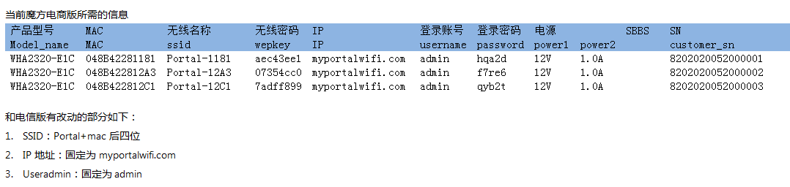
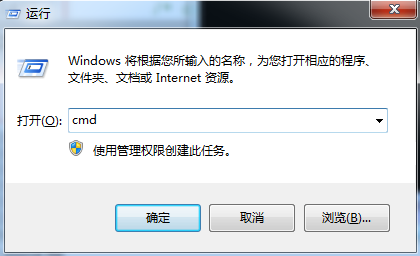
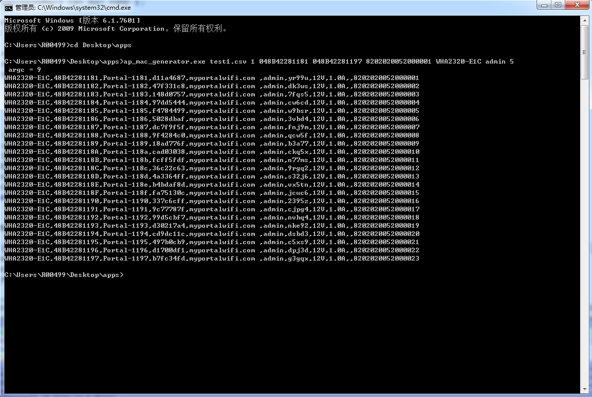

# PreInstall

To building this Please preinstall VC or VS at first. and setting var path at ``.\nmake\makefile.Mak`` as following:

```Makefile
################################   Var Defination #############
PROJECT_NAME=ap_mac_generator
IDE_PATH=D:\Program Files (x86)\Microsoft Visual Studio
VAR=$(IDE_PATH)\VC98\Bin\VCVARS32.BAT
INCLUDE_PATH=$(IDE_PATH)\VC98\Include
LIB_PATH=$(IDE_PATH)\VC98\Lib
################################   Var Defination #########################
```

The ``D:\Program Files (x86)\Microsoft Visual Studio`` its my VC  path.

**(Note: If encounters error message for system environment ,then please found and run ``VCVARS32.BAT`` at PC, or just run script at ``.\nmake\vc_env\VCVARS32.BAT`` ) **


# NMake Usage

The files within `.\AP_Mac_Builder` are new added which for generate Mac address and SN list to factory for AP project,  `.\AP_Mac_Builder\vc_nmake`  contains ``CL.EXE`` and ``LINK.EXE`` which used to building *.exe in windows , files structure  as following:

```shell
./nmake 
├── ap_mac_generator.c
├── Makefile
├── makefile.mak
├── md5.h
├── switch.h
├── test.txt
├── Include
└── vc_nmake	
	└── Lib

```

make process or just run ``make.bat``

```shell
> cd MAC_Builder\AP_Mac_Builder\
> cls
> nmake /f makefile.mak clean all test
```

output format as following:




# Test Case

解压文件至桌面，Win + R 打开  ``CMD`` 如图：






运行命令将会在当前目录下生成文本文件。如图

命令参数如下：


```shell
>.\ap_mac_generator.exe test1.csv 4 048B42281181 048B42281197 8202020052000001 WHA2320-E1C admin 5
 
参数
Usage: 
<OUTPUT-FILE-NAME> 	test1.csv			输出文件名
<MAC_INTERVAL> 		4 					用于控制生成 mac 间隔数
<MAC_from> 			048B42281181		起始 MAC 地址
<MAC_to> 			048B42281197 		结束 MAC 地址
<GponSN> 			8202020052000001 	起始 sn 
<Device type>		WHA2320-E1C			产品型号
<username>			admin				用户名
<userkey:5bit/8bit>	5					生成密码位数

```


